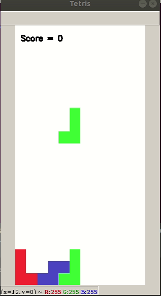

# tetris

Classic game made with python



## Installation

### Linux

One of the dependencies is the keyboard package, that
will run properly only if it was installed as root. 
To install from source, proceed with

```
git clone http://github.com/fmndantas/tetris.git
cd tetris
sudo pip3 install .
```

## Run game

### Linux

``sudo tetris``